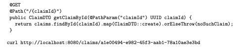
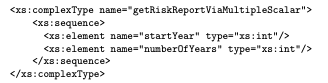
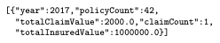

# Atomic Parameter Pattern

## Introduction 
This pattern is then used when we want to pass or return a single parameter from a API Endpoint.
 
## Problem 
How can the API Provider define a single unit for the in or the out parameter of an API Endpoint. 

## Forces 
One of the forces this pattern addresses is the contract, the shared knowledge between provider and consumer and therefore the coupling of these for single parameters. 
Some other high level forces are the following: 
- Interoperabillity 
- Performance 
- Processing effort 
- Learning effort and Maintainability 
- Security 

##  Solution 
To exchange simple unstructured data such as a string or number, you need to define a single scalar in and or out parameter in the API Contract. It is also advised to restrict this value (value range). Try to use a primitive type that can be transmitted easily. 

## Example: 

 
### Practical Examples 
There are tons of example, one of them is https://catfact.ninja/.
 
# Atomic parameter list 

## Introduction 
This pattern is used to define a contract between provider and consumer when there might be more then one piece of information needs to be transmitted.

## Forces 
The same high level forces apply as in the previous pattern. This pattern is used when two or more unstructured information items need to be transmitted. Instead of transmitting all the pieces seperately we want to transmitt them all at the same time. 

## Solution 
To solve this problem we populate an ordered list with multiple atomic parameters. Name them, order them in a logical way and mark optional parameters.

## Example
In parameter example:

 
Out parameter example: 

 
### Practical Examples 
Twitter api: https://microservice-api-patterns.org/patterns/structure/representationElements/AtomicParameterList.html

# Exam Questions
The atomic parameter list pattern can be applied both to the in parameter and out parameter of an API endpoint: True 

Are primitive data types preferred for the atomic parameter pattern: True 
 
 
 