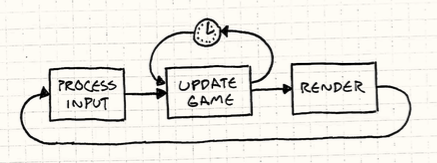

# Game Loop 

## Context 

When programming a video game, the program must handle and process the user input, update the state of the game accordingly to the user input and render the game.  

## Problem 

How do we implement a loop where the game processes user input without blocking and can control the rate of gameplay without speeding up or slowing down depending on the hardware. 

## Forces 
- Performance 
- Hardware variability 
- Gaming experience 

## Solution 

To avoid the problem of having the game speed up because of hardware we can implement a fixed FPS (frames per second) solution. If the game can process and render everything in less than that time the game will play smoothly. But if the game takes longer than the fixed amount of time we dedicated per frame, our sleep timer will go negative. 

To counteract this problem, we can implement the game loop in such a way that more than 60 FPS is calculated in one loop. The longer the frame takes, the bigger steps the game takes per loop to calculate everything. This is called variable or fluid time step. 

- The game plays at a consistent rate on different hardware 
- Players with faster machines are rewarded with smoother gameplay 

The problem with this approach is that we've made the game non-deterministic. 

Instead of updating the elapsed time we can play catch up where we calculate the lag between the in-game clock and the real time clock. The loop will wait with rendering until the game has updated the current in-game events according to real time. 



The last issue with this approach is that we update the game in fixed time steps but render the game in inconsistent time steps. Conveniently, we know exactly how far between two update frames we are. This time is stored in the variable lag. We can pass this variable into the render method to render objects in the game accordingly. 

## Example 

```java
double previous = getCurrentTime(); 

double lag = 0.0; 

while(true) { 

    double current = getCurrentTime(); 

    double elapsed = current - previous; 

    previous = current; 

    lag += elapsed; 

    processInput(); 

    while(lag >= MS_PER_UPDATE) { 

        update();

        lag -= MS_PER_UPDATE; 

    } 

    render(lag / MS_PER_UPDATE); 

} 
```

## Questions 
<details>
    <summary>
        Does calculating the steps dynamically mean that the game loop is now non-deterministic?
    </summary>
    Yes
</details>

<details>
    <summary>
        Should hardware determine the game speed?
    </summary>
    No
</details>