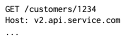
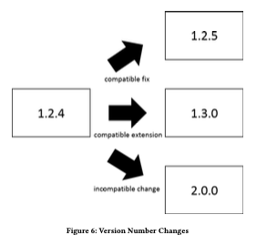
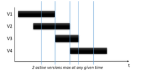

# Version Identifier 

## Context 

An API changes overtime as production evolves. New versions get released with improved functionality but with the cost that at some point the newer versions are no longer backwards compatible. 

## Problem 

How can an API Provider communicate to clients about newer versions and the possibility of incompatible changes in newer versions? 

## Forces 
- Accuracy of exact identification of API versions 
- Minimizing impact on the client side caused by API changes  
- Guaranteeing that API changes do not lead to accidentally breaking compability between client and provider on the semantic level 
- Traceability of API versions in use for governance 

## Solution 

Introduce an explicit version indicator. Introduce these version indicators in the exchanged messages of client and provider. 

## Example 

Stick to a consistent versioning strategy and indicate which versions are compatible and which aren’t for the client. 

# Semantic Versioning 

## Context 

If an API provider uses numerical version identifiers it is not clear for the client how significant the changes are between the different versions. In consequence the client has to analyze the changes himself to know beforehand if the usage of the new API version will break his application or not. 

## Problem 

How can stakeholders compare API versions immediately to know if they are compatible or not? 

## Forces 
- Minimal effort to detect version incompatibility (especially for the client). 
- Manageability of API versions and related governance effort (e.g., approval processes, quality gates, number of parallel versions, number of branches of API versions). 
- Clarity of change impact.  
- Clear separation ofchanges with different levels of impact and compatibility. 
- Clarity with regard to evolution timeline of the API. 

## Solution 

Introduce a three-number versioning scheme x.y.z, which allow the API provider to indicate the changes in each version. These numbers are usually called major, minor and patch. 

Major meaning the changes are incompatible with the prior versions, minor if new functionality is provided without breaking any compatiblitiy with prior versions and the patch number is incremented for compatible bug fixes. 

## Example 

# Two In production 

## Context 

It is possible that an API changes so much overtime, that new versions won’t be backward compatible, and breaking existing clients. 

## Problem 

How can a provider gradually update without breaking existing clients, and without having large amounts of different versions in production.  

## Forces 
- Different lifecycles for client and provider 
- Api changes do not lead to backwards compatibility problems 
- Ability to rollback 
- Minimizing needed client changes 
- Minimizing maintenance effort for client 

## Solution 

Deploy and support two versions of an API endpoint that provide variations of same functionality. Update and decommission (deprecate and remove) as updates roll in. More then two versions would also be possible.  

## Example 

# Limited Lifetime Guarantee 

## Context 

API is published and at least one client uses it. Providers cannot influence evolution of the client and forcing the client to change is considered high cost. The provider does not want to make any breaking changes. 

## Problem 

How can provider let clients know how long they can rely on the published api version.  

## Forces 

Make client-side changes caused by api changes plannable and limit maintenance effort for supporting old clients.  

## Solution 

Guarantee to not break published api for a given fixed time frame. Label each release with an expiration date.  

## Example 
- Facebook core API und SDK, 2 Jahre Garantie 
- Google Adwords, 10 Monate Garantie 

# Exam Questions 

Are major Versions in the Semantic Versioning Pattern generally not compatible with each other? 

Yes

With the use of two different Versions in the Two in Production pattern, compatibility between client and provider will never break.

No

