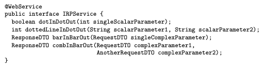

# Parameter Tree Pattern 

### Context 

One or more scalars are defined, but message format does not satisfy message receiver information need or contain undesired semantic dependencies between list elements.  

### Problem 

How do you exchange repetitive or nested data between consumer and provider.  

### Forces 

Top level forces 

- Interoperability 

- Performance 

- Processing effort 

- Maintainability 

- Security 

Expressiveness vs efficiency. Used when receiver needs more expressiveness than atomic parameter list pattern can solve. 

### Solution 

Define single root, that contains one or more subordinate composite/aggregate data structures such as tuples and arrays. Can be applied recursively to structure to further nest data.  

### Example

# Parameter Forest Pattern 

### Context 

There have been API Endpoints defined with specific requirements of rich information that have to be exchanged for the API call to be successful. 

### Problem 

How can we exchange complex nested data between consumer and provider in a message-based API call? 

### Forces 

Same forces as Parameter Tree Pattern 

### Solution 

Just like parameter tree pattern we will send a simple and/or composite/aggregate data structure representation. But instead of one data structure, we will send multiple. Each one of these data structures qualify as Atomic Parameter or Parameter Tree. 

### Example 

Dot (for -> Atomic Parameter), Dotted Line (for -> Atomic Parameter List), Bar (for -> Parameter Tree), and Comb (for Parameter Forest). 

# Pagination Pattern 

### Context 

API consumer makes request to API, and the API consumer might have to respond with a large data set (ex: from database).  

### Problem 

How can a provider progressively return large amounts of data, if it doesn’t fit in one single message. 

### Forces 

Data set size, user needs, number of records required in one response.  

Variability of data: all result elements identically structured? 

Network capabilities. 

Memory available for request.  

### Solution 

Divide the data into manageable chunks/pages of smaller data. The provider sends only a small set of data in the first message with some meta data to inform the consumer on how to retrieve additional results. The size of the page can be fixed in the service contract or can be specified by the consumer in each request. 

### Example 

# Exam Questions 
- Which pattern does the Parameter Forest Pattern extend? -> Parameter Tree Pattern 
- Name a possible way to specify the size of a page -> Service contract or by the consumer 